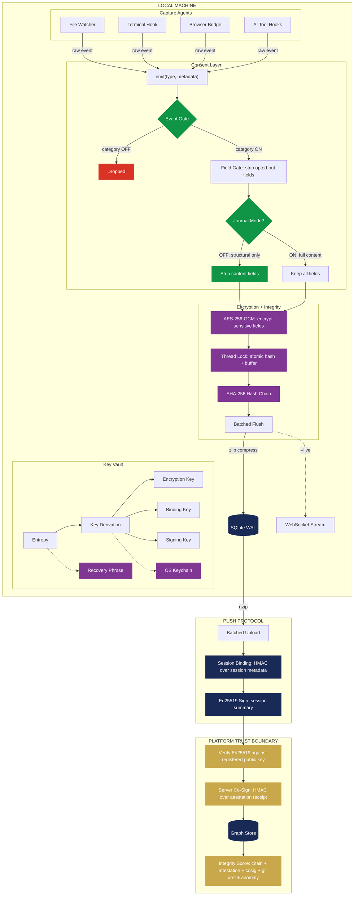

<p align="center">
  
</p>

<p align="center">
  <a href="https://pypi.org/project/methodproof/"></a>
  <a href="https://pypi.org/project/methodproof/"></a>
  <a href="https://github.com/MethodProof/methodproof-cli/blob/main/LICENSE"></a>
</p>

# MethodProof

**Your engineering process, visualized as a knowledge graph.**

MethodProof captures how you work — terminal commands, file edits, git commits, AI interactions — and renders it as an interactive process graph you can explore, share, and prove.

No account required. Fully offline. Your data stays on your machine unless you explicitly push it.

<p align="center">
  
</p>

## Install

```bash
pip install methodproof
```

## Quick Start

```bash
methodproof init      # choose what to capture, install hooks
methodproof start     # begin recording
# ... code normally ...
methodproof stop      # stop recording, build process graph
methodproof view      # explore your session in the browser
```

`methodproof view` opens a D3-powered interactive graph: every action is a node, every relationship is an edge. You see exactly how your session unfolded — which commands led to which edits, when you consulted AI, where you hit dead ends and recovered.

## Features

- **Process graph** — D3 interactive visualization of your entire session as a knowledge graph
- **Prompt analysis** — 35 structural metadata dimensions extracted from every AI prompt (intent, cognitive level, specificity, context dependency) — no content stored
- **Environment profiling** — structural analysis of your AI dev environment (instruction files, tool counts, MCP servers) captured at session start
- **Outcome metrics** — first-shot apply rate, follow-up sequences, phase transitions computed at session end
- **Granular consent** — 10 standard capture categories + 1 premium, each independently toggled. Nothing records without your opt-in
- **Local-first** — SQLite database at `~/.methodproof/`, `chmod 600`, zlib-compressed metadata. No network calls unless you choose
- **Live streaming** — `methodproof start --live` streams events to the platform in real-time over WebSocket
- **Integrity verification** — hash-chained events + Ed25519 attestation prove sessions haven't been tampered with
- **E2E encryption** — optional company-held AES-256-GCM encryption the platform cannot decrypt
- **Auto-detection** — hooks for shell, Claude Code, OpenClaw, codex, gemini, aider installed automatically
- **Platform sync** — `methodproof push` uploads sessions. `methodproof publish` makes them public and shareable

## Live Session TUI

`mp start` launches a rich terminal UI that streams captured events in real-time. Events are color-coded by role (purple = AI input, gold = AI output, cream = human, green = verification) and indented into causal chains with Unicode tree characters.

### Controls

| Key | Action | Description |
|-----|--------|-------------|
| `j` | Journal toggle | Show/hide full content lines (prompts, completions, diffs) mid-session |
| `f` | Filter cycle | All → AI input → AI output → Human → Verify |
| `s` | Scroll lock | Freeze scroll position while events buffer; release snaps to bottom |
| `/` | Search | Filter feed — non-matching lines render dimmed |
| `tab` | Sidebar cycle | Stats → Recent files → Recent tools |
| `t` | Tree collapse | Hide chain inners, show `+N` count on closer |
| `d` | Timestamp format | Clock (`12:34:56`) → Relative (`+1.2s`) → Elapsed (`45.3s`) |
| `c` | Copy last event | Full JSON metadata to clipboard |
| `enter` | Event detail | Modal overlay with all metadata fields |
| `m` | Quiet mode | Hide dim events (music, environment, MCP, context compaction) |
| `p` | Pause | Pause/resume event polling |
| `q` | Exit TUI | Detach — daemon keeps recording. Reconnect with `mp connect` |
| `x` | End session | Stop recording with confirmation prompt |

Active modes display as badges in the session bar: `J` (journal), `⏸` (scroll locked), `Q` (quiet), `T` (tree collapsed), filter name when not "all". Source tracking shows which AI tool session (`claude #1`, `codex #2`) generated each event.

## Security Architecture

Every event passes through consent gating, encryption, and hash chaining before touching disk. The platform adds a server co-signature on push, creating two-party evidence.



<sup>Green = consent gates · Purple = cryptographic operations · Navy = storage + binding · Gold = integrity verification</sup>

## Commands

| Command | What it does |
|---------|-------------|
| `init` | Interactive consent selector, install hooks, create data directory |
| `start [--dir .] [--tags t1,t2] [--public] [--live] [--journal] [--e2e]` | Start recording (auto-connects if session already active) |
| `stop` | Stop recording, build process graph |
| `connect [session_id]` | Attach TUI to an active session (defaults to current) |
| `view [session_id]` | Open session graph in browser |
| `log` | List sessions with sync status, visibility, tags |
| `login [--api-url URL]` | Authenticate with the platform |
| `push [session_id] [--local]` | Upload session (`--local` targets localhost:8000) |
| `publish [session_id] [--anonymous]` | Set public + push (redaction applied) |
| `tag <session_id> <tags>` | Add tags |
| `delete <session_id> [-f]` | Delete session and all its data |
| `consent` | Change capture, research, and redaction settings |
| `review` | Inspect session data before pushing |
| `journal on/off/status` | Toggle journal mode (full content capture) |
| `e2e on/off/status/recover/release` | Manage personal E2E encryption keys |
| `extension pair/status/install` | Browser extension pairing |
| `proxy start/stop/status/cert` | Local AI API proxy (deep capture) |
| `update [--auto/--no-auto]` | Check for and install CLI updates |
| `lock [--purge]` | Destroy local encryption key (recoverable) |
| `uninstall [--keep-sessions]` | Remove all hooks, data, and config |

## Privacy & Consent

<details>
<summary>How consent works</summary>

On first `init`, you choose exactly which categories to capture:

```
MethodProof — Full Spectrum

All data stays local in ~/.methodproof/. Nothing leaves your
machine unless you explicitly run `mp push` or `mp publish`.

  [x]  1. terminal_commands    Commands you run and their exit codes
  [x]  2. command_output       First 500 chars of command output (secrets auto filtered)
  [x]  3. test_results         Pass/fail counts from pytest, jest, go test, cargo test
  [x]  4. file_changes         File create, edit, and delete events with paths and line counts
  [x]  5. git_commits          Commit hashes, messages, and changed file lists
  [x]  6. ai_prompts           Your interactions with AI agents: prompts, slash commands,
                                mode switches, and tool management. Captured as graph nodes
  [x]  7. ai_responses         AI agent responses, tool calls, and results
  [x]  8. browser              Page visits, tab switches, searches, copy events (via extension)
  [x]  9. music                Now Playing track and artist (Spotify, Apple Music, etc.)
  [x] 10. environment_analysis Structural profile of your AI dev environment: instruction file
                                sizes, tool counts, config fingerprints (no file content stored)

  [ ]  0. code_capture         Full file diffs and git patches (Pro only, encrypted, private)

  Toggle: enter number (0 for code capture) | a = all 10 on | n = all off | done = confirm
```

Categories are enforced at three levels:
- **Agent level** — disabled agents don't start
- **Event level** — events from disabled categories are dropped
- **Field level** — specific fields stripped from events that are otherwise captured

Change anytime with `methodproof consent`. Inspect data before pushing with `methodproof review`.

</details>

<details>
<summary>Capture categories reference</summary>

| Category | Events | Details |
|----------|--------|---------|
| `terminal_commands` | `terminal_cmd` | Command text, exit code, duration. Sensitive commands auto-filtered |
| `command_output` | field in `terminal_cmd` | First 500 chars of stdout. Redacted for sensitive patterns |
| `test_results` | `test_run` | Framework name, pass/fail counts, duration |
| `file_changes` | `file_create`, `file_edit`, `file_delete` | File paths, language, line counts |
| `git_commits` | `git_commit` | Short hash, commit message, changed file list |
| `ai_prompts` | `user_prompt`, `llm_prompt`, `agent_prompt` | Prompt metadata + 35 structural analysis fields (intent, cognitive level, specificity, etc.) |
| `ai_responses` | `llm_completion`, `agent_completion`, tool events | Response metadata, tool calls, latency |
| `browser` | browser events | Metadata only — no page content, no search text, no copied text |
| `music` | `music_playing` | Track, artist, source, player |
| `environment_analysis` | `environment_profile` | Instruction file sizes/sections/fingerprints, hook/plugin/MCP counts |
| `code_capture` | field in `file_edit`, `git_commit` | Full diffs (Pro only, AES-256-GCM encrypted, private by default) |

</details>

<details>
<summary>Prompt analysis — what gets extracted</summary>

Every AI prompt is structurally analyzed at capture time. The full prompt text is read to extract metadata, then discarded — no content is stored. Fields include:

| Dimension | Fields | Examples |
|-----------|--------|---------|
| **Intent** | `sa_intent` | `instruction`, `strategic_question`, `bug_report`, `correction`, `selection`, `verification` |
| **Cognitive level** | `sa_cognitive_level` | `information`, `analysis`, `synthesis`, `evaluation`, `execution`, `decision` |
| **Specificity** | `sa_specificity_score`, `sa_named_files`, `sa_named_functions`, `sa_named_technologies` | 0.0 (vague) to 1.0 (precise) |
| **Context dependency** | `sa_context_dependency`, `sa_pronoun_count`, `sa_is_follow_up` | `total` (e.g. "Option B"), `low` (self-contained) |
| **Collaboration mode** | `sa_collaboration_mode` | `delegating`, `thinking_together`, `reviewing`, `selecting`, `correcting` |
| **Structure** | `sa_has_code_blocks`, `sa_has_error_trace`, `sa_has_constraints`, `sa_is_compound` | Booleans and counts |

At session end, outcome metrics are computed: first-shot apply rate, follow-up sequences, phase transitions, and correction counts.

</details>

## Integrity & Encryption

<details>
<summary>Integrity verification</summary>

Four layers ensure session data hasn't been tampered with (see [architecture diagram](#security-architecture) above):

**Hash-chained events** — every event includes a SHA-256 hash linking to the previous event. Hash computation is thread-safe (atomic with buffer append). Any modification breaks the chain, detectable via `GET /sessions/{id}/chain/verify`.

**Ed25519 attestation** — on `methodproof push`, the CLI signs a session summary with your private key. Key generated during `methodproof init`, stored in `~/.methodproof/`.

**Server co-signature** — the platform independently signs the attestation receipt with its own key and timestamp, creating two-party evidence. Sessions pushed without server co-signature receive a lower integrity score.

**Binary hash self-reporting** — the CLI reports its own source hash on push. The platform compares against known release hashes to detect modified builds.

</details>

<details>
<summary>E2E encryption</summary>

For company-managed encryption where the platform cannot read your data:

```bash
pip install methodproof[e2e]
```

Set your company's key in `~/.methodproof/config.json`:

```json
{ "e2e_key": "<64-char-hex-key>" }
```

All sensitive metadata (prompts, completions, commands, output, diffs) is encrypted with AES-256-GCM before storage and before any platform sync.

</details>

## Integrations

`methodproof init` auto-detects and installs hooks for:

- **Shell** — bash/zsh preexec/precmd hooks
- **Claude Code** — prompt, tool, agent, and session event hooks (structural analysis on prompts)
- **OpenClaw** — hook + skill for agent telemetry
- **AI CLIs** — codex, gemini, aider command wrappers
- **MCP server** — registered with Claude Code for session/graph queries

## Watch Scope

`methodproof start` watches the **current directory recursively** (or the directory passed via `--dir`). Every file create, edit, and delete under that tree generates an event.

**Start in the right directory.** If you start in a monorepo root, you'll capture events from every subdirectory. If you start in a subdirectory, parent-level changes won't be recorded.

```bash
cd my-project          # scope to this project
methodproof start

cd ~/code              # ⚠️ captures ALL projects under ~/code
methodproof start
```

**Excluded patterns:** `__pycache__`, `.pyc`, `.git/`, `node_modules`, `.DS_Store`, `.swp`, temp files ending in `~`

**Git commits** are detected automatically — only commits in a git repo rooted at (or above) the watch directory are captured.

## Local Development

Push sessions to a local API for testing:

```bash
# One-time: login to your local API
mp login --api-url http://localhost:8000

# Push with --local flag (overrides stored URL for this command)
mp push --local

# Or set the env var (works with any command)
METHODPROOF_API_URL=http://localhost:8000 mp push
```

`--local` is a shorthand for `http://localhost:8000`. It does not clobber your production token — it only overrides the API URL for that invocation.

You still need a valid JWT from the local API. Run `mp login --api-url http://localhost:8000` once to authenticate against your local platform.

## Data Directory

`~/.methodproof/`

| File | Purpose |
|------|---------|
| `config.json` | API URL, auth token, consent settings, E2E key (chmod 600) |
| `methodproof.db` | Sessions, events, graph (chmod 600) |
| `commands.jsonl` | Shell command log |

## License

[Apache 2.0](LICENSE)
